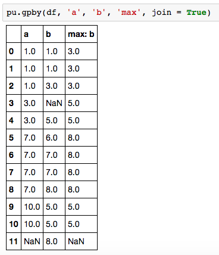
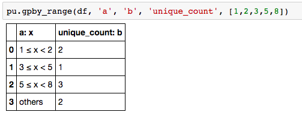

```python
gpby(df, gp_feature, aggr_feature, aggr_func, join = True)
```

Input:  
* df:  target dataframe  
* gp_feature: the feature to perform group by  
* aggr_feature: the feature to perform aggregation function  
* aggr_func (aggregation function): 'unique_count', 'mean', 'max', 'min', 'sum', 'list'  
* join: True:   join the 'new group by table' to original table (df)  
        False:  return the 'new group by table' only  

```python
gpby_range(df, gp_feature, aggr_feature, aggr_func, value_list)
```

Input:
* df, gp_feature, aggr_feature, aggr_func: same from above. 
* value_list: the list where the range of each group is based on. Will be sorted in ascending order.

Example:    

df =   
   

Peforming 'mean' aggregation. Missing values will be ignored except when aggr function = 'list'. 
  

if join = True, then the resulting dataframe will be joined back to the original dataframe. 
  

by setting up value list, groups are split based on it. Missing values and Values outside of the range specified by value list will go to 'others' group.
  
